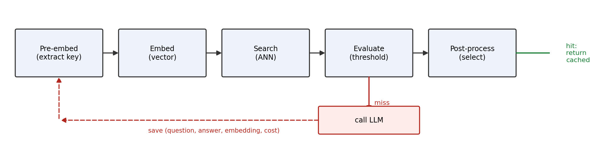
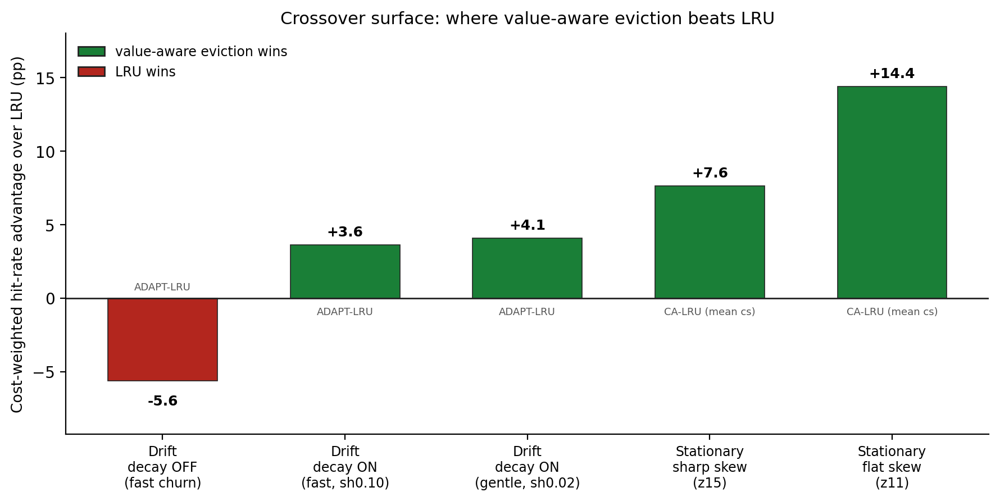

# Cost-Aware W-TinyLFU for Semantic LLM Caches

> **STATUS: full first draft, figures + references complete.** All sections (1-10) are drafted prose,
> every empirical claim traced to a measured `paired.py`-verified result (see the evidence index).
> Figures 1-2 generated from the JSONs via `docs/figures/make_figures.py`. References are web-verified
> (venues, volumes, pages, DOIs, arXiv IDs) and cited inline. One item remains before final: the LMSYS
> workload-composition histogram flagged in 6.2 (needs a light data run on your HF-gated access).

---

## 0. Format & scope (settled)

- **Length:** 10–15pp.
- **Storage scope:** IN SCOPE as a co-contribution beside CA_W_TINYLFU. §9 is a full section.
- **Voice:** match last year's example write-up (on hand).
- **Audience:** the course lecturer, Gil Einziger: assume expert reader; keep GPTCache/W-TinyLFU
  background tight (no tutorial), spend the page budget on results + honesty.

---

## 1. Abstract

> **DRAFTED PROSE.**

Semantic caches for large language models store past answers and serve them for queries that are close
enough in embedding space, avoiding a real LLM call on a hit. But not all misses cost the same: a miss
on a long GPT-5 answer is far more expensive to regenerate than a miss on a short open-weights reply, so
raw hit rate is the wrong objective for an LLM cache and cost-weighted hit rate is the right one. GPTCache,
the reference open-source semantic cache, ships only cost-blind recency and frequency eviction (cachetools
LRU/LFU). We add CA_W_TINYLFU, a cost-aware W-TinyLFU policy that folds a per-answer regeneration cost
(model tier, output tokens, latency) into TinyLFU's admission decision, plus a read-time frequency
decay and an adaptive window for the drifting-workload case. Measured with paired-seed statistics
(n = 7) on full-stack GPTCache replays of two real conversation datasets, the policy beats LRU on
cost-weighted hit rate in both regimes a cache faces: under a drifting hot set, with decay on, adaptive
CA_W_TINYLFU beats LRU by +3.6 to +4.1pp (7/7 seeds, Wilcoxon p = 0.016); under stationary skew it beats
LRU in all 42 cells tested (+4.6 to +15.9pp), replicated on a second dataset. Against GDSF, the classic
cost-aware policy and our closest prior art, CA_W_TINYLFU _beats_ cost-weighted hit rate by +4.6pp (7/7)
under flat stationary skew and ties under drift and sharp skew, while also exposing a tunable
`cost_priority` dial GDSF has no equivalent for. We are deliberately honest about scope: an isolation ablation
shows the cost term itself pays under sharp skew but is within noise under flat skew, and a user-facing
`cost_priority` dial trades raw hit rate for cost savings along a clean but coarse Pareto curve. Alongside the policy we contribute a storage co-optimization (MRL embedding
truncation plus an HNSW/SQ8 index) reaching 5.7-9.8x index-RAM compression on a Pareto frontier.

## 2. Introduction / motivation

> **DRAFTED PROSE.**

A semantic cache for LLMs embeds each incoming query, searches a vector store for a sufficiently similar
past query, and returns the stored answer on a hit, calling the real model only on a miss. This turns
expensive generation into cheap approximate lookup, and GPTCache is the reference open-source
implementation of the pattern [GPTCache]. Like any cache of bounded size, it must eventually evict, and eviction is
where an LLM cache differs from a page or object cache in a way that matters.

The difference is that LLM answers have **heterogeneous regeneration cost**. Evicting a cached GPT-5
answer that took thousands of output tokens and seconds of latency to produce is not the same as
evicting a short reply from a small open-weights model: if either is missed later, the first costs far
more to regenerate. A policy that maximizes hit *rate* treats those two evictions as equal. The right
objective is the **cost-weighted** hit rate, the fraction of total regeneration cost the cache actually
avoided, and a good policy should preferentially retain the answers that are expensive to rebuild.

GPTCache does not do this. Its eviction layer offers only the cost-blind cachetools policies (LRU, LFU,
FIFO, RR); nothing in the stack can see, let alone act on, per-answer cost. That is the gap we close. We
contribute **CA_W_TINYLFU**, a cost-aware W-TinyLFU eviction policy (Section 4) that reuses Caffeine's
proven structure and changes only the admission decision to weight frequency by regeneration cost, with
a read-time frequency decay and an optional adaptive window for drifting workloads, and a user-facing
dial that lets an operator choose where to sit on the money-versus-quality trade. We evaluate it with
paired-seed statistics on full-stack replays of two real conversation datasets (Sections 6-7), and we
report both where it wins decisively and where the cost term washes out. We benchmark not only cost-blind
LRU but GDSF, the classic cost-aware policy that is our closest prior art, and report the head-to-head
plainly: a cost-weighted win under flat stationary skew, a tie elsewhere. Section 9 adds an independent
storage co-contribution on the same cache. Throughout, every empirical claim is tied to a measured, sign-consistent result rather than
an averaged headline.

## 3. Background

> **DRAFTED PROSE.**

### 3.1 The GPTCache request flow

GPTCache turns every LLM call into a semantic lookup. The raw request is pre-processed to a text key,
embedded into a float vector, and searched against a vector store; each candidate is scored by a
similarity evaluator against a threshold, and a post-processor selects one qualifying answer to return.
Only on a miss is the real LLM called, after which the question, answer and embedding are saved back.
The vector index and the scalar store (questions, answers, metadata) are separate backends, joined by a
shared integer id per entry, which matters for eviction: removing an entry means retiring that id in
both stores.



**Figure 1.** The GPTCache request path. On a hit the cached answer is returned without an LLM call; on
a miss the LLM is invoked and the question, answer, embedding and (for the cost-aware policy) cost are
saved back. _[docs/figures/make_figures.py]_

### 3.2 The eviction layer

Eviction sits beside the two stores as a policy over ids. It holds only a key-set mirror of the live
ids, seeded at init from the scalar store and updated on every `save` (which forwards the new ids, and
now optionally their costs) and every hit. When the policy decides to evict, it does not delete rows
inline; it invokes an `on_evict` callback that **soft-evicts** the chosen ids (marks them deleted) and
triggers a batched hard delete in the scalar and vector stores once enough have accumulated. This
indirection is what lets a policy be swapped in without touching the store code: a policy only ever sees
ids and emits ids to evict. The shipped `MemoryCacheEviction` backs this with cachetools LRU/LFU/FIFO/RR
(and a no-op variant that delegates to Redis-native eviction on the distributed path); our policy plugs
into the same interface.

### 3.3 W-TinyLFU

We build directly on W-TinyLFU [TinyLFU] as realised in Caffeine [Caffeine]: a small window LRU in front
of a segmented main (probation and protected), admission gated by a Count-Min sketch [CM-Sketch] with
periodic aging and a doorkeeper Bloom filter [Bloom] that keeps one-hit wonders out of the sketch. We take this structure as given and reuse it
unchanged; our contribution is confined to the admission score and to how the window and the sketch are
adapted over time (Section 4). The one property we lean on explicitly is that the sketch is a
frequency estimator *decoupled from residency*, so an evicted-then-returning item is still recognised as
popular, which is what lets the policy keep beating LRU once we add a cost term.

### 3.4 Cost-aware caching prior art

Weighting eviction by a per-item cost, not just access frequency, is the GreedyDual line, made practical
as GreedyDual-Size [GD-Size] and its frequency-scaled variant GDSF [GDSF], where an item's retention
value combines its recency, its access count and its fetch cost. That lineage was developed for web and storage caches with
uniform, directly-measured object sizes and fetch latencies. What is new here is fusing a cost term into
**TinyLFU admission** specifically, and doing so for a **semantic** LLM cache, where the "cost" is
heterogeneous answer regeneration (model tier, output tokens, latency) rather than object size, and
where the cached keys are approximate vector matches rather than exact lookups. GDSF is not just related
work but the correct baseline, so we implement it in the same harness and benchmark against it directly
(Section 7.3b).

## 4. Design: CA_W_TINYLFU

> **DRAFTED PROSE. Grounded in `gptcache/manager/eviction/ca_w_tinylfu.py`.**

CA_W_TINYLFU keeps the W-TinyLFU structure intact and changes only the admission decision: when a new
item contests for a cache slot, it is scored not just by how often it is accessed but by how expensive
its answer is to regenerate. The rest of this section builds that up as a sequence of
baseline-weakness → fix steps.

### 4.1 Cost model: reaching the policy with a real regeneration cost

**Weakness.** The shipped policies decide what to keep from access pattern alone; they cannot see that a
cache miss on a GPT-5 answer costs far more to serve than a miss on a short open-weights reply.

**Fix.** Each cached answer carries an `LLMCost` object whose scalar is
`generation_latency_ms × model_tier × (1 + token_count / 1000)`, folding wall-clock delay and pricing
tier into one number (Section 6.2). The cost reaches the policy through the existing save path: the
adapter builds the cost and forwards it as `data_manager.save(..., llm_cost=...)`, which becomes the
`costs=` argument to `eviction.put()`. If no cost is supplied every item gets an identical default,
which collapses the policy cleanly to plain W-TinyLFU rather than failing.

### 4.2 Value-weighted admission and eviction

**Weakness.** Plain W-TinyLFU admits the item the access frequency prefers, cost-blind: a popular but
cheap answer will evict a rarely-repeated but very expensive one.

**Fix.** New items land in a small **window** LRU (~1% of capacity) unconditionally. When the window is
full its LRU victim enters an **admission contest** against the LRU end of the **probation** segment
(the main store is probation + protected, ~20/80). The winner is chosen by a lexicographic score

```
score = freq_score × freq_weight + cost_score        (both terms in [0, 15])
```

with `freq_weight = 16`. Because one unit of frequency (16) outweighs the entire cost range (max 15),
frequency still dominates: a twice-accessed cheap item always beats a once-accessed expensive one, and
**cost only breaks ties within a frequency level**. This is the conservative default; it adds cost
sensitivity without letting cost override a genuine popularity signal. The frequency estimate comes from
a shared **Count-Min sketch**, not a per-resident counter, so a popular item that was evicted and
returns is still recognised as popular (the property that lets TinyLFU beat LRU). A **doorkeeper** Bloom
filter suppresses one-hit wonders: a key must be seen twice before it increments the sketch. Raw costs
span roughly three orders of magnitude, so `cost_score` is not the raw cost but an **EWMA z-score** of
`log(cost)`, mapped to `[0, 15]` and held neutral (8.0) during a short warmup, which keeps a single
extreme-cost outlier from swamping the ordering. Exactly one item leaves per contest by construction,
so cachetools' batch `clean_size` knob does not apply and is deliberately not forwarded.

### 4.2b The `cost_priority` dial: a user-facing money-vs-quality knob

The lexicographic default is one end of a spectrum. The caller can pass a single `cost_priority` in
`[0, 1]` that sets `freq_weight = 16 − 15 × cost_priority`: at `0` the policy is the frequency-dominated
default above (maximize hit rate, cost only breaks ties); at `1` `freq_weight` falls to 1, putting cost
on equal footing with frequency (keep the expensive-to-regenerate answers, spend hit rate to do it). So
the operator states directly how much regeneration cost they will pay to raise answer quality, and the
cache honours it along a measured curve. This is characterized as a clean Pareto endpoint trade in
Section 7.5. _[bench_cost_priority/]_

### 4.3 Adaptive window (ADAPT)

**Weakness.** The window-to-main split that is optimal under stationary skew is wrong under drift: when
the hot set moves, a larger window absorbs the churn, but the best size depends on the drift rate and
cannot be fixed ahead of time.

**Fix.** With `adaptive_window=True` the window↔main boundary self-tunes by a Caffeine-style hill-climb,
but climbing the **cost-weighted** hit rate rather than the raw hit rate (the novel twist). Three guards
keep the climb from chasing noise: each decision averages the objective over several intervals; a
two-sided gradient probe samples both larger and smaller windows before committing a direction (instead
of always growing first); and a reversal fires only after two consecutive regressions (hysteresis). The
interval right after a move is discarded as a settling period so the climber reads the new steady state,
not a transient. Default off is byte-for-byte identical to the fixed-window policy, so it is a pure
opt-in. This is the variant that wins the drift regime (Section 7.1).

### 4.4 Time-decay: forgetting a stale hot set

**Weakness.** A shared frequency sketch has long memory, which is exactly wrong under drift: a
once-hot item keeps a high count long after it has gone cold and clings to a slot it no longer earns.

**Fix.** Frequency is discounted at **read time** by an EWMA-style factor:
`freq_score = min(sketch.estimate, 15) × exp(−λ · dt)`, where `dt` is the idle time since the item was
last accessed. An idle item shrinks its own weight without disturbing the shared sketch or any other
item's score. With `λ = 1e-5` an item idle ~19 hours loses about half its weight; when `dt ≈ 0` (a fast
replay with no wall-clock gaps) decay is a no-op and scoring is pure frequency. The benchmark advances a
virtual clock per query to exercise decay deterministically; Section 7.1 shows it is the lever that
turns the drift regime from an LRU loss into a win.

### 4.5 Hash-DoS defence

**Weakness.** An attacker who can guess the hashing could flood the sketch to pin a chosen victim in
cache, or inflate a victim's frequency so no legitimate candidate can ever displace it.

**Fix.** The sketch and doorkeeper use seeded hashing, and the admission contest keeps Caffeine's
[Caffeine] hash-DoS valve: a candidate that loses on score but is at least moderately warm (raw sketch estimate
≥ 7) still gets a 1/128 random chance to be admitted. The guard reads the **raw, undecayed** estimate so
an attacker cannot evade it by pausing to let decay shrink the signal. _[commit 34507bc]_

## 5. Implementation notes

> **DRAFTED PROSE.**

The policy is a drop-in addition, not a fork. It implements the same `put(objs, costs=None)` / `get`
eviction interface as the shipped cachetools backends and is selected by name (`eviction="CA_W_TINYLFU"`),
so nothing in the data-manager or adapter code needs to know which policy is active. Two properties keep
it low-risk to adopt. First, the cost plumbing **degrades cleanly**: the adapter builds an `LLMCost` and
forwards it through `save`, but if no cost is available the argument is simply absent and every item
takes an identical default cost, which reduces the policy to plain W-TinyLFU rather than erroring.
Second, cost is **only read by CA_W_TINYLFU**; the cachetools policies ignore the `costs` argument
entirely, so the feature adds zero overhead when it is not used.

The whole policy is pure-Python standard library (no numpy in the hot path): the Count-Min sketch,
doorkeeper Bloom filter, EWMA cost tracker and LRU segments are all hand-rolled over `OrderedDict` and
`bytearray`, which keeps the eviction dependency surface empty. One testing caveat is worth recording:
because the sketch and doorkeeper use seeded hashing over Python's built-in `hash`, tests that assert on
exact eviction outcomes must pin `PYTHONHASHSEED`; the statistical tests instead assert on aggregate
behaviour across seeds to stay robust to hash ordering. _[ca_w_tinylfu.py; memory_cache.py; test_ca_w_tinylfu.py]_

## 6. Experimental setup

> **DRAFTED PROSE (first section). Review voice/scope before we draft the rest.**

### 6.1 Harness and workload

All eviction results come from `benchmark_lmsys.py`, a full-stack replay harness: every query runs
the complete GPTCache path: sentence-transformer encode → FAISS search → similarity gate → on-miss
`save` with eviction, against a fresh, disk-backed `SSDataManager` (SQLite scalar store + FAISS
vector index) built per configuration. A "hit" is therefore a genuine semantic match above threshold,
not a synthetic key lookup, and every measured latency includes the real SQLite commit and FAISS
round-trip. This is deliberately heavier than an in-memory policy microbenchmark: we are measuring the
policy _inside the system it ships in_.

We replay two real LLM-conversation datasets, both HF-gated: **LMSYS-Chat-1M** (`lmsys/lmsys-chat-1m`)
[LMSYS] and **WildChat-1M** (`allenai/WildChat-1M`) [WildChat]. WildChat is the external-validity replication: a
different user population with the same row shape (a per-row `model` field and a `conversation`
message list), so the identical loader and cost mapping apply unchanged. From each we stream the first
3000 valid **first-turn** `(user, assistant)` exchanges, keeping only prompts ≤ 512 tokens with a
response of ≥ 5 tokens. Token counts are exact **tiktoken** `cl100k_base` counts (`_count_tokens`).

### 6.2 Cost model

Each cached answer carries a regeneration-cost scalar

```
LLMCost = generation_latency_ms × model_tier × (1 + token_count / 1000)
```

The **model tier** is read from the conversation's real model name: `gpt-5*` → 20, Claude family → 15,
open-weights (`llama`/`vicuna`/`mistral`/`falcon`/…) → 0.5, everything else (gpt-3.5 and other hosted
models) → 1.0. So cost heterogeneity is grounded in which model actually produced each answer, not
synthesised. **Tokens are exact**; only the **latency term is modeled** (`base[tier] + 4 ms/token`), because a real 30 000-query × multi-seed × multi-policy replay against paid
APIs would be both expensive and non-reproducible, and the paired design (6.5) needs a deterministic
stream. This is a deliberate, disclosed simplification: `LLMCost` is dominated by `model_tier`
(20 ≫ 1 ≫ 0.5), so the _cost ordering_ of items, the only thing admission acts on, is insensitive to
the latency calibration. Real measured latency is Future Work (Section 10).

Crucially, the two datasets sit at **very different points on the cost-composition axis**, which is what
makes the replication across them meaningful. On the 3000-entry pools (seed 0):

| dataset | expensive (tier ≥ 15) | `LLMCost` min / median / p99 / max | tiers seen |
|---|---|---|---|
| LMSYS | 0.9% (28/3000) | 824 / 1491 / 9897 / 441098 | 0.5, 1.0, 15.0, 20.0 |
| WildChat | 48.8% | 824 / 9574 / 718848 / 1493960 | 1.0, 20.0 |

LMSYS is dominated by cheap open-weights and gpt-3.5 answers with a thin expensive tail (its median cost
is ~6x below WildChat's, and only ~1% of items are premium-tier), whereas WildChat is nearly half
premium-tier. That the stationary CA-beats-LRU result holds on both (Section 7.2) means it is not an
artifact of one dataset's cost mix. It also frames the cost-isolation nuance (Section 7.3): with only
0.9% expensive items, LMSYS gives the cost term little to grip, which is consistent with the CA − FREQ
ablation being smaller and noisier on LMSYS than on WildChat.

### 6.3 Embedding and cache configuration

Queries are embedded with **`all-MiniLM-L6-v2`** (384-d, L2-normalised) [SBERT] and searched against a
FAISS [Faiss] flat index with `top_k = 10`. The similarity gate uses GPTCache's `SearchDistanceEvaluation`
(range 0–4, `score = 4 − squared_L2`); at the reported `similarity_threshold = 0.80` a hit requires
squared-L2 ≤ 0.80, i.e. cosine ≥ 0.60. Eviction is triggered at `max_size` with `clean_size = 0.20 ×
max_size`. Cache sizes are **25 / 50 / 100** for the stationary grid (small relative to the working set,
so eviction pressure is real) and **200** for the `cost_priority` dial sweep.

### 6.4 Metrics

Three quality metrics, computed over the whole replay:

- **`cost_weighted_hit_rate` (primary)** = Σ`LLMCost` over hits ÷ Σ`LLMCost` over all queries: the
  fraction of _regeneration cost_ the cache avoided. This is the objective the contribution targets;
  we always report it as cost-weighted hit rate, never as a bare "hit rate".
- **`hit_rate`** = hits ÷ queries, the classic, cost-blind objective, kept to show what the cost
  weighting trades away.
- **`token_saving_ratio`** = tokens saved on hits ÷ total tokens, a cost-adjacent proxy independent of
  the tier weighting.

Latency (p50/p95/p99) and throughput are recorded but are **not** the eviction claim; the thesis makes
no latency claim about the policy, only about storage (Section 7). Because the Zipf stream and the
seeded Count-Min sketch are deterministic, the three quality metrics are **repeat-invariant** for
LFU / WTINYLFU_FREQ / CA_W_TINYLFU (measured per-seed std = 0); only LRU's tie-ordering wiggles
(≤ 0.17pp). We therefore run the quality grid at `--repeats 1`, since repeats only re-measure latency.

### 6.5 Policies

Six policies, all behind the same eviction interface:

- **LRU, LFU**: the cachetools policies GPTCache ships; cost-blind. The in-system baseline.
- **GDSF**: GreedyDual-Size-Frequency [GDSF], the classic cost-aware policy and closest prior art
  (Section 3.4), implemented in the same harness with fetch cost = `LLMCost` and size = 1. The demanding
  baseline for the cost term: unlike LRU it already keeps expensive-and-frequent items, so beating it is
  not free.
- **WTINYLFU_FREQ**: the frequency-only twin, our `CostAwareWTinyLFU` with `cost_aware=False`. Same
  W-TinyLFU machinery (windowed SLRU + Count-Min admission), zero cost weighting. This isolates _what
  the cost term adds_: the CA − FREQ ablation in Section 7.3.
- **CA_W_TINYLFU**: the contribution, cost-weighted admission (`window_ratio = 0.01`,
  `freq_weight = 16`, `cost_priority` default). Only this policy reads the `LLMCost` passed through
  `save`.
- **CA_W_TINYLFU_ADAPT**: same policy with the window↔main boundary self-tuning via a Caffeine-style
  hill-climb; the drift-regime variant.

### 6.6 Two regimes

A semantic cache faces two access regimes, and we test both by controlling the drift stream's hot-set
rotation:

- **Stationary skew** (`--drift-rotate 0`): a fixed Zipf distribution over the entry pool, working set
  larger than the cache. This is frequency's regime. We test two skews: **z11** (Zipf α = 1.1, _flat_:
  hits spread near-uniformly, shallow hot set) and **z15** (α = 1.5, _sharp_: a few items dominate).
- **Drift** (`--drift-rotate N > 0`): the rank→item map cyclically rotates every N queries, so the hot
  set moves over time; recency's regime, LRU's bet.

Both regimes replay a **30 000-query** stream over the 3000-entry pool, so re-access (and thus eviction)
actually happens.

### 6.7 Statistics: paired seeds

Seeds are **paired**: seed _k_ feeds the _same_ query stream to every policy, so the correct confidence
statement about "A beats B" is the per-seed paired delta A − B, not the difference of unpaired means.
Cross-seed variance here is _difficulty_ variance (some streams are simply harder) and is large
(the z11 cost-weighted spread runs ±9–14pp), which would swamp a real +2–4pp effect if reported as
unpaired mean ± std. Pairing cancels it. We run **seeds 0–6 (n = 7)** and report, per cell, the paired
mean delta, the **sign-consistency count** (positive in k/7 seeds), an **exact two-sided Wilcoxon
signed-rank** p-value (enumerating all 2^7 sign assignments, so no normal approximation), and a paired-t
95% confidence interval, all via `paired.py`. At n = 7 a fully sign-consistent result (7/7 or 0/7) gives
p = 0.016, the exact-test floor, so every _decisive_ claim below carries p = 0.016 with a CI excluding
zero; every _tie_ claim is backed by a large p and a CI that bounds the effect within a point or two of
zero (a paired equivalence check), not merely by a mid-range sign count. A result is only claimed when it
is sign-consistent _and_ its CI excludes zero.

## 7. Results

> **DRAFTED PROSE. All numbers verified against the JSONs via `paired.py`.**

### 7.1 Drift regime: time-decay turns the LRU loss into a win

Under drift the hot set moves, so recency is the natural fit and plain frequency is actively harmful:
a once-hot item keeps its high count long after it has gone cold, so W-TinyLFU without decay clings to
stale entries. The data confirms this. With read-time decay **off** (`virtual-clock-sec=0`), our
adaptive policy loses to LRU in its own regime: paired ADAPT − LRU is **−5.6pp** cost-weighted hit rate
at cs100 (2/8 seeds positive; shift 0.10, rotate 3000, Zipf 1.2).

Turning on the EWMA time-decay (advancing a virtual clock, `virtual-clock-sec=120`) flips the sign at
the same drift setting. ADAPT now beats LRU on cost-weighted hit rate by **+3.63pp** under fast drift
(shift 0.10, 7/7 seeds) and **+4.10pp** under gentle drift (shift 0.02, 7/7); both are Wilcoxon p = 0.016
(the exact n = 7 floor) with 95% CIs excluding zero (gentle-drift cost_wt +4.10 ± 1.59); token-saving is
up 7/7 in both, and raw hit rate is up 7/7 under gentle drift, 5/7 under fast drift. So **decay is the lever**: the single controlled change of turning it on moves ADAPT from a ~6pp
loss to a ~4pp win over LRU, letting a frequency-based policy win the recency regime LRU was built for.

| ADAPT − LRU, cs100 | cost_wt (pp) | hit (pp) | tok (pp) |
|---|---|---|---|
| decay off (vc0), shift 0.10 | −5.64 [2/8] | −7.85 [0/8] | −7.07 [0/8] |
| decay on (vc120), fast drift (shift 0.10) | **+3.63 [7/7]** | +0.47 [5/7] | +1.51 [7/7] |
| decay on (vc120), gentle drift (shift 0.02) | **+4.10 [7/7]** | +1.41 [7/7] | +2.54 [7/7] |

_[bench_lmsys/drift_e2_seed\*.json (decay off); decaytuned_sh{10,02}_vc120_seed\*.json (decay on); paired.py]_

### 7.2 Stationary regime: frequency and cost-awareness crush LRU

When the hot set is fixed and the working set exceeds the cache, frequency dominates recency, and this
is where CA_W_TINYLFU wins most decisively. On lmsys, paired CA − LRU is **positive in all 6 cells for
all 7 seeds (42/42)** on cost-weighted hit rate, ranging **+4.6 to +15.9pp** (every cell Wilcoxon
p = 0.016, the n = 7 floor, with CIs excluding zero), with hit rate and token-saving likewise 7/7
everywhere. The win **replicates on WildChat** (a second dataset, different
user population): again 42/42, same sign and ballpark. This is a strong replication precisely because
the two datasets have very different cost compositions (LMSYS 0.9% expensive vs WildChat 48.8%, Section
6.2): the stationary CA-beats-LRU result is not an artifact of one dataset's cost mix.

| cost_wt CA − LRU | z11 cs25/50/100 (flat skew) | z15 cs25/50/100 (sharp skew) |
|---|---|---|
| lmsys | +12.8 / +14.6 / +15.9 | +9.3 / +9.1 / +4.6 |
| WildChat | +19.3 / +15.6 / +12.6 | +9.1 / +5.4 / +2.2 |

All 24 cells 7/7. Note the shape: the advantage over LRU is **largest under flat skew** (z11) and
**shrinks with cache size under sharp skew** (z15, down to +2.2/+4.6 at cs100). Under sharp skew a few
items take almost all hits, so even LRU eventually holds them and a larger cache lets it catch up; under
flat skew there is no small hot set for recency to stumble into, so keeping the frequency-and-cost
winners pays most. _[bench_lmsys/win_z{11,15}_seed0–6.json; bench_wildchat/win_z{11,15}_seed0–6.json; paired.py]_

### 7.3 Cost-isolation ablation: what the cost term itself adds (CA − FREQ)

The CA − LRU win conflates two changes: switching to W-TinyLFU frequency, and adding cost weighting on
top. To isolate the **cost term**, we compare CA_W_TINYLFU against WTINYLFU_FREQ, which is the identical
policy with `cost_aware=False`, so the only difference is whether admission is cost-weighted. The result
is regime-dependent, and we report it honestly.

Under **sharp skew** the cost term is sign-consistent at the larger caches: on lmsys z15 cs50/cs100 are
7/7 (+1.8/+3.8pp), cs25 is 5/7 (+1.9pp). Under **flat skew** it is noisy on lmsys except at the largest
cache (z11 cs100 7/7 +7.3pp; cs25/cs50 only 4/7, with wide cross-seed variance ±8.7/±4.1pp). WildChat
**replicates and is cleaner**: the cost term is 7/7 on cost-weighted hit rate in 5 of 6 cells (z11
+4.8/+2.1/+3.5, cs50 dips to 6/7; z15 +1.3/+1.1/+1.1 all 7/7).

In both datasets the cost term shows the same design signature: it **trades raw hit rate for
cost-weighted value**. Hit rate goes flat-to-negative (lmsys z11 0-1/7 positive; WildChat z11 4/7, 0/7,
3/7) while token-saving rises almost everywhere. This is the mechanism working as intended, preferring
expensive-to-regenerate answers over merely popular ones.

Why the flat-skew noise is a finding, not a defect: when access is near-uniform, frequency carries
little signal and *which* expensive item happens to be hot is largely seed luck, so the cost term's
benefit is swamped by cross-seed difficulty variance. Cost-awareness pays when there is a hot set to be
cost-selective *within*; a flat distribution gives any policy little structure to exploit.
_[bench_lmsys/win_z{11,15}_seed0–6.json; bench_wildchat/win_z{11,15}_seed0–6.json; paired.py CA − FREQ]_

### 7.3b Head-to-head with the cost-aware baseline (GDSF)

Beating cost-blind LRU is the easy bar. The demanding comparison is against **GDSF** (Section 3.4), the
classic cost-aware policy and our closest prior art, which already folds fetch cost and access count into
one retention score `H(i) = L + F(i)·C(i)/S(i)` and so, unlike LRU, already prefers
expensive-and-frequent items. We run GDSF through the identical harness (fetch cost = `LLMCost`,
size = 1) against CA_W_TINYLFU at cs100 in **four cells**: the **drift** regime (vc120, shift 0.02) at a
flat (α = 1.1) and default (α = 1.2) skew, and the **stationary** regime at a flat (z11, α = 1.1) and
sharp (z15, α = 1.5) skew. The heavy-tail flat cells were **pre-registered** as the ones that should most
favour TinyLFU admission: a flatter tail means more near-one-hit-wonders, which GDSF admits on first
sight but the SLRU + Count-Min admission filter is built to reject.

The picture is regime-dependent, and in the regime where CA is strongest it is a decisive win. Under
**drift** the two policies tie on cost-weighted hit rate (paired CA − GDSF −0.43 [4/7], p = 0.94 at
α=1.1; +0.39 [4/7], p = 0.81 at α=1.2; the sign flips across seeds), with GDSF holding a small but
sign-consistent raw-hit and token edge (0/7, p = 0.016 both). But under **stationary flat skew** (z11),
the same regime where CA's margin over LRU is largest (7.2), CA **beats** GDSF on cost-weighted hit rate
by **+4.56pp (7/7 seeds, p = 0.016, 95% CI [+1.2, +8.0])** and on token-saving by +2.14pp (7/7,
p = 0.016), while raw hit rate is a wash (−0.89, 2/7, p = 0.08, CI [−1.8, +0.1] straddling zero).
Under **stationary sharp skew** (z15) it returns to a tie (−1.50 [3/7], p = 0.94, CI ±4.9 spanning zero),
where GDSF keeps a small sign-consistent raw-hit edge (−0.81, 0/7, p = 0.016). So CA does not
merely match the cost-aware baseline: it ties GDSF under drift and sharp skew and _overtakes_ it under
flat stationary skew.

The mechanism is the **admission filter**, and this is where the pre-registered heavy-tail hypothesis
finally pays. GDSF admits every arriving item into the cache (evict-while-full, then insert at F = 1), so
each one-hit-wonder forces the eviction of a resident on arrival; CA's window + doorkeeper + Count-Min
admission can **reject** the newcomer outright without disturbing a valuable resident. A flat tail is
dense in near-singletons, so under stationary flat skew CA rejects a stream of them that GDSF keeps
churning through, and the cost-weighted gap opens. We registered this hypothesis for the _drift_ flat
cell up front and it failed there — the rotating hot set washes the filter's advantage out — but it holds
under _stationary_ flat skew, where the distribution is stable enough for the filter to matter. We report
the failed and the confirmed cell both.

| CA − GDSF, cs100 | cost_wt (pp) | hit (pp) | tok (pp) |
|---|---|---|---|
| drift, α=1.1 | −0.43 [4/7] | −2.32 [0/7] | −1.16 [0/7] |
| drift, α=1.2 | +0.39 [4/7] | −2.55 [0/7] | −0.88 [0/7] |
| stationary flat (z11) | **+4.56 [7/7]** | −0.89 [2/7] | **+2.14 [7/7]** |
| stationary sharp (z15) | −1.50 [3/7] | −0.81 [0/7] | −0.39 [1/7] |

**Robustness across cache size and dataset.** The cs100 result above is the headline, but the flat-skew
win is not an artifact of one cache size or one corpus. Re-running the two stationary cells across
cs ∈ {25, 50, 100} on both lmsys and WildChat (paired n = 5, seeds 0–4) keeps the same shape. Under
**flat skew** (z11) CA's cost-weighted edge over GDSF is positive at every cache size on both datasets; on
WildChat it is sign-consistent 5/5 at all three sizes and tight (+3.60 ± 0.60pp at cs100), while on lmsys
the mean is larger but the interval is wide because a single \$441,098 outlier query dominates the
cost-weighted variance at small caches. Token-saving is +[5/5] on both datasets at every size. Under
**sharp skew** (z15) the cell stays a tie on both: WildChat sits within a fraction of a point of zero at
all sizes (−0.10 to +0.78pp), and lmsys shows no sign-consistent direction (the same cost outlier swings
it +6.2 at cs25 to −2.1 at cs100). At n = 5 the exact Wilcoxon floor is p = 0.062, so these cells are read
off the interval and the sign count, not the p-value.

| CA − GDSF | cost_wt lmsys | cost_wt WildChat | tok lmsys | tok WildChat |
|---|---|---|---|---|
| _flat (z11)_ cs25 | +8.27 [4/5] | +6.15 [5/5] | +5.73 [5/5] | +3.89 [5/5] |
| cs50 | +4.61 [3/5] | +4.78 [5/5] | +4.35 [5/5] | +2.56 [5/5] |
| cs100 | +5.80 [5/5] | +3.60 [5/5] | +1.86 [5/5] | +1.71 [5/5] |
| _sharp (z15)_ cs25 | +6.16 [4/5] | +0.78 [3/5] | +0.30 [3/5] | −0.06 [2/5] |
| cs50 | +3.78 [4/5] | −0.10 [2/5] | +0.79 [5/5] | −0.44 [1/5] |
| cs100 | −2.08 [3/5] | −0.03 [4/5] | −0.62 [0/5] | −0.30 [1/5] |

Paired n = 5 (seeds 0–4). The flat-skew cost-weighted win holds at every cache size on both lmsys and
WildChat; the sharp-skew cell stays a tie on both. lmsys small-cache CIs are wide (single cost outlier);
WildChat is tight and sign-consistent.

Beyond the measured cost-weighted win under flat skew, CA has what GDSF structurally lacks: the
user-facing `cost_priority` dial (7.5), frequency estimation decoupled from residency via the shared
sketch, and an O(1)-amortized admission step against GDSF's priority-queue reheapify on every eviction.
That scaling argument is **analytical, not measured**: at the n ≤ 200 caches tested the per-op difference
is invisible, so we claim it as a design property, not a result.
_[bench_lmsys/gdsf_z11_seed\*.json, gdsf_vc120_seed\*.json (drift); gdsfstat_z{11,15}_seed\*.json (stationary); paired.py CA − GDSF]_

### 7.4 Crossover surface

Reading 7.1-7.3 together gives one map. LRU's advantage is confined to a fast-churning hot set **with
decay off**; enable decay and even that corner is clawed back (7.1). Anywhere the hot set has stability,
frequency-based admission wins, and the margin over LRU grows as the skew flattens (7.2). The cost term
then adds further cost-weighted value wherever there is a hot set to be selective within, i.e. under
sharp skew and larger caches (7.3). The regimes where each lever pays are complementary, not
overlapping.



**Figure 2.** Cost-weighted hit-rate advantage over LRU (pp) across regimes (lmsys, paired n=7). Left to
right: drift with decay off (ADAPT loses), drift with decay on at two drift rates, and stationary sharp
(z15) and flat (z11) skew (CA, mean over cache sizes). The single red bar is the only regime where LRU
wins. _[bench_lmsys; paired.py; docs/figures/make_figures.py]_

### 7.5 The `cost_priority` dial: a clean money-vs-quality Pareto knob

The dial is measured on drift, cs200, paired n=7 (seeds 0-6), which collapses the ±10-13pp cross-seed
spread that made an earlier single-seed sweep unreliable. Paired means: LFU 61.1, cp0 67.4, ..., cp0.75
69.1, cp1 69.9 (cost-weighted hit rate %).

Two results. First, **using CA at all dominates LFU**: every dial setting beats LFU on cost-weighted hit
rate by **+6.3 to +8.8pp** (t = 3.1-4.5, 6-7/7 seeds) and on token-saving by +4.5-5.2pp (7/7). Second,
**the dial endpoints are a clean Pareto trade**: moving cp0 → cp1 raises cost-weighted hit rate
**+2.47pp** (t = 4.7, 7/7) while spending raw hit rate **−4.13pp** (t = −10.1, 0/7), with token-saving
flat (+0.45pp, ns). So the operator turns money-saved up and answer quality down along a measured curve.

Two honest bounds. (i) At full cost-priority, cp1 gives up its hit-rate edge over LFU (−0.43pp, 2/7, ns),
so maximizing money-saved costs the quality advantage that the interior dial settings keep. (ii) The dial
**interior is within noise** (adjacent steps are only 2-5/7 sign-consistent), so `cost_priority` is a
coarse high/low knob, not a fine monotone control; only the endpoints separate cleanly. Latency (p50/p95)
and memory are flat across the sweep, so the knob itself is free. _[bench_cost_priority/cp_seed{0..6}.json; paired]_

### 7.6 Latency: the wins carry no tail-latency penalty

Policy choice does not materially affect latency: p95 stays within ~1ms across all four policies in both
regimes, since the ~10ms per-query cost is dominated by the SQLite and FAISS round-trip, not admission
bookkeeping. Under flat skew the frequency-based policies run a fuller cache and show ~10-15% lower
throughput than LRU (z11 p50 CA ~9-10ms vs LRU ~4.5-8.7ms), but the tail is flat and the
cost-weighted-hit-rate gains carry no tail-latency cost. This answers the obvious "value-weighted
admission with a Count-Min sketch must be slower" objection.
_[bench_wildchat/win_z{11,15}_seed0–6.json latency_p50/p95_ms]_

## 8. Discussion / threats to validity

> **DRAFTED PROSE.**

**Where cost-awareness does not help.** The honest boundary of the contribution is flat skew. The
cost-isolation ablation (7.3) shows the cost term is within cross-seed noise when the access
distribution is near-uniform, because there is then no stable hot set to be cost-selective within and
which expensive item happens to be popular is mostly seed luck. This is a property of the workload, not
a bug in the policy, and we state it first rather than bury it: cost-awareness pays when there is
structure to exploit (sharp skew, or larger caches), and does no harm when there is not (the cost term
never made CA lose to FREQ, it just failed to help).

**Single-configuration recommendation.** If a deployment must pick one setting, use CA_W_TINYLFU with
the adaptive window on. It wins the drift regime outright (7.1) and is at worst equal to the
fixed-window policy under stationary skew, where CA already crushes LRU (7.2). The `cost_priority` dial
should be treated as a coarse two-position choice (default for balanced, high for money-saving), not a
continuous control, since only its endpoints separate cleanly (7.5).

**Threats to validity.** (i) The **latency term** in the cost model is modeled rather than measured;
token counts are exact tiktoken counts, but per-answer latency is `base[tier] + 4ms/token` because a
real multi-seed multi-policy replay against paid APIs is neither affordable nor reproducible. Since
`LLMCost` is tier-dominated, the item cost *ordering* that admission acts on is insensitive to this
calibration, so it does not threaten the eviction result, but absolute cost figures are not to be read
as real latencies. (ii) Both regimes are evaluated at **n = 7 seeds**; the stationary win is replicated
on **two datasets** (lmsys and WildChat), but the drift win is shown on lmsys only, so drift external
validity is weaker than stationary. (iii) The policy is validated on the **in-memory** eviction path;
the Redis backend delegates to Redis-native eviction and remains cost-blind, so these results do not
transfer to the distributed path as-is. (iv) The storage measurements (Section 9) are **fresh-index,
no-eviction**, so the tombstone steady state under sustained eviction is uncharacterized. (v) The **GDSF
head-to-head** (7.3b) drift cells are at cs100 on lmsys only; the stationary flat-win and sharp-tie are
swept across cs ∈ {25, 50, 100} and replicated on WildChat, but those sweep cells are n = 5 (Wilcoxon
floor p = 0.062) and the lmsys small-cache CIs are wide (single cost outlier), so the sweep corroborates
the cs100 headline by direction rather than by an independent significant test. The O(1)-versus-reheapify
scaling claim is analytical, not measured at these small n. Items (ii-v) are addressed as Future Work
(Section 10).

## 9. Storage co-contribution: SBERTMRL + HNSW/SQ8

> **DRAFTED PROSE. Grounded in `bench_real_100k/frontier.md` (100K real-encoder run).**

The eviction policy decides *what* to keep; this section attacks *how cheaply* each kept vector is
stored. GPTCache's default is a Faiss flat float32 index over full-dimension embeddings, which is exact
but memory-heavy. We combine two levers to shrink it, and measure the accuracy cost honestly on a 100K
real-encoder run (data = qqp, 2000 TP + 2000 FP probe queries per cell).

### 9.1 SBERTMRL: truncatable embeddings

Matryoshka Representation Learning (MRL) [MRL] trains an encoder so that any leading prefix of the
embedding is itself a usable embedding. `SBERTMRL` exploits this: it slices the full vector to a `target_dim` and
re-normalizes, so a 768-d model can be stored at 256-d with a graceful, not catastrophic, accuracy
cost. Truncation is the first compression lever and is orthogonal to the index. _[sbert_mrl.py]_

### 9.2 Faiss HNSW + SQ8 / PQ

The second lever is the index. We add an HNSW graph [HNSW] with 8-bit scalar quantization (SQ8) or
product quantization (PQ) as an alternative to flat float32. HNSW gives O(log n) search; SQ8/PQ quantize each
stored vector to a fraction of its float32 footprint. HNSW cannot structurally delete, so removals are
handled by a tombstone set with over-fetch-and-filter on search and a `rebuild()` to compact, the same
soft-delete shape the eviction layer already uses. _[faiss.py]_

### 9.3 Result: a compression Pareto frontier

Against the ONNX/768/Flat baseline (cell A), the MRL/256 cells reach measured index-RAM compression of
**5.7x (SQ8 M=32) → 7.5x (SQ8 M=16, cell G) → 9.8x (PQ, cell E)**, with HNSW cutting search latency
~100x (flat ≈19ms p95 → HNSW ≈0.2-0.3ms). The non-dominated set is **E → G**: E is the max-compression
point (315 B/vec), G is the recall-ceiling point (408 B/vec at 98.85% TP). We frame the result as this
frontier rather than a single "12x" headline, because the last compression is bought with accuracy that
has to be examined, not assumed. _[bench_real_100k/results.json; frontier.md]_

### 9.3.1 Accuracy is mostly a threshold artifact, not a truncation cost

At the single global 0.90 threshold the MRL cells look worse on false positives (18.5% → 24.8-40.9%).
But that threshold was tuned for the 768-d baseline, and it sits at a different point on each cell's PR
curve. A per-cell threshold sweep shows that at a threshold matched to the baseline's precision the MRL
cells hold true-positive rate **at or above** the baseline (E @0.92: TP 0.882 at precision 0.864; G
@0.94: TP 0.900 at precision 0.838) while still at 7.5-9.8x less RAM. An isolation cell I (MRL/768/Flat,
which swaps *only* the encoder and holds dimension and index fixed) attributes the false-positive rise
to the **encoder swap (+14.4pp)**, not to truncation: truncating 768→256 adds only +7.9pp on top with
SQ8, and with PQ it actually *lowers* FP by 8.0pp. So MRL truncation is defensible; the precision change
is dominated by the stronger-but-looser encoder, and PQ claws it back. _[frontier.md, isolation + sweep sections]_

### 9.3.2 The genuine costs

Two costs are real and we report them plainly. First, **end-to-end latency rises** even though search
falls: A 59ms → E/G 97-98ms → I 117ms p95, because the MRL encoder is slower per query than ONNX and
embedding dominates e2e (search is ≤0.3ms either way). The ~100x search speedup is real but invisible at
e2e under this encoder, so we quote search-p95 and e2e-p95 separately rather than letting the search
number stand in for user-visible latency. Second, the **tombstone steady state** under sustained
eviction is unmeasured: all storage numbers are fresh-index, no-eviction, so they are best-case on RAM
(deletes do not reclaim space until rebuild) and on search (over-fetch grows with tombstone fraction).
_[bench_real_100k/results.json e2e_latency_ms]_

### 9.3.3 Cell J: making the e2e win bankable

The e2e-latency cost in 9.3.2 is encoder-bound, so we add one more operating point that swaps the
encoder for `static-retrieval-mrl-en-v1` [StaticEmb], a static token-embedding-lookup model with no
transformer forward pass, at the *same* MRL/256/HNSW+PQ index. This collapses e2e p95 from 97.5ms to **0.50ms** at
identical 9.8x compression, moving the bottleneck off the encoder entirely. The cost is recall: it is a
weaker encoder, about **-12.9pp TP at matched precision** (~0.86), trailing even the baseline there. So
the storage frontier has three honest operating points, not one: **A** (recall and latency, no
compression), **E/G** (compression, encoder-bound e2e), and **J** (compression *and* sub-millisecond
e2e, paid for in recall). _[frontier.md, cell J]_

## 10. Embedding-cache co-contribution: CachedEmbedding

> **DRAFTED PROSE. Grounded in `bench_embedding_cache/results_seed{0-6}.json` and `paired_stats.json`.**

The eviction policy (§4) decides which *answers* stay resident; the storage section (§9) shrinks how each
kept *vector* is stored. Neither touches a cheaper miss further upstream: every incoming request, hit or
miss, first pays for an embedding forward pass, and GPTCache's default `embedding_func` recomputes that
pass from scratch even when the exact same text was embedded moments earlier. `CachedEmbedding` closes
that specific gap. _[gptcache/embedding/cached_embedding.py]_

### 10.1 Design: an LRU wrapper, not a new encoder

`CachedEmbedding` decorates any existing `BaseEmbedding` backend (SBERT, OpenAI, ...) with an in-process
LRU cache (`cachetools.LRUCache`) keyed on the exact input string. On a cache hit it returns a defensive
copy of the stored vector without touching the wrapped model; on a miss it delegates, then stores a copy
for next time. Composition rather than inheritance means it drops in around any backend with one line and
changes nothing about the rest of the stack — no core file was modified. Two implementation details matter
for correctness: results are copied on both the read and write path, so a caller mutating a returned array
in place cannot corrupt the cached entry, and only hashable string inputs are cached — list/batch calls and
non-text backends (image, audio) pass straight through untouched. _[tests/unit_tests/embedding/test_cached_embedding.py,
8/8 passing]_

### 10.2 Honesty trap: this is an exact-match cache, not a semantic one

The benefit of `CachedEmbedding` is capped by one number: how often the *exact same string* recurs in the
traffic. GPTCache's vector search already resolves near-duplicates and paraphrases at the similarity-search
layer, so this cache cannot and does not attempt to help there — it only ever fires on a byte-for-byte
repeat. We do not assume a savings figure. A `--dataset synthetic` mode fixes the exact-repeat ratio for a
network-free structural smoke test, and every real-data run prints the *measured* exact-duplicate ratio of
its query stream before reporting any speedup, so a low number is a valid, reportable result on a
low-repeat corpus, not a bug to be hidden. On a single pass through 2,000 distinct UltraChat prompts
(`--dataset ultrachat`, no replay) the duplicate ratio measures 0.0% and the cache correctly shows no
benefit (1.02x) — the honest negative result the trap is designed to surface. _[bench_embedding_cache/results.json]_

### 10.3 Why a separate benchmark script, not `benchmark_lmsys.py`

`benchmark_lmsys.py` (§6) computes every embedding once, up front, in a single batched `model.encode(...)`
call, then looks vectors up by index during the eviction replay. That is a correct, deliberate optimization
of *that* harness — it isolates eviction-policy cost from embedding cost — but it means the harness never
calls `to_embeddings()` per incoming query, so it structurally cannot exercise a per-query embedding cache.
`benchmark_embedding_cache.py` is a separate script that reuses `benchmark_lmsys.py`'s loaders and
`drift_query_stream` verbatim, but walks the resulting stream one prompt at a time, calling
`to_embeddings()` per query — faithfully reproducing how a live GPTCache deployment actually calls
`embedding_func`. Neither script was modified to accommodate the other. _[examples/benchmark/benchmark_embedding_cache.py]_

### 10.4 Result: consistent, statistically significant speedup under realistic repeat traffic

We replay 5,000 UltraChat queries through the same Zipf-skewed, hot-set-rotating stream generator
(`drift_query_stream`) that §6–7 use for the eviction experiments, over 7 seeds, and time a plain SBERT
encoder against the same encoder wrapped in `CachedEmbedding` (cache size 10,000, back-to-back within each
seed's run to hold background conditions constant across the two arms). The measured exact-duplicate ratio
of this stream is 75.6–76.5% across seeds, and cache hit rate tracks it almost exactly in every seed
(e.g. seed 0: 76.5% duplicates → 76.5% hit rate), which is itself a correctness check: the cache is neither
under- nor over-firing relative to the traffic it sees.

The cache was faster than the uncached baseline in **7/7 seeds** (range 3.18x–4.79x, geometric mean
**3.80x**, robust to one noisy run), Wilcoxon signed-rank **p = 0.0156** — significant at α = 0.05 despite
the small n. Absolute wall-clock times varied across runs on the (shared, non-isolated) benchmark machine —
e.g. baseline ranged 176–210s across seeds for a fixed 5,000-query stream — which is machine noise, not
signal; the paired, within-seed comparison is what the significance claim rests on, following the same
paired-seed protocol §6.7 uses for the eviction results. _[bench_embedding_cache/paired_stats.json]_

### 10.5 Scope and limits

This result says nothing about semantic near-duplicates, which are out of scope by design (§10.2). It also
does not model cache eviction under memory pressure: `cache_size=10,000` was large enough that no entry
observed in this run was evicted before being re-requested, so the measured hit rate is an upper bound for
this workload size, not a general guarantee — a corpus with more distinct hot text than the cache can hold
would show a lower hit rate, degrading gracefully via the underlying LRU rather than failing. Finally, like
§9's storage numbers, this is a fresh-process, single-workload measurement; a production deployment would
want to additionally track cache memory footprint over long uptime, which we did not measure here.

## 11. Conclusion

> **DRAFTED PROSE.**

We set out to make a semantic LLM cache evict by *value*, not just by access pattern. CA_W_TINYLFU does
this by folding a per-answer regeneration cost into TinyLFU admission, and it beats cost-blind LRU on
cost-weighted hit rate in both regimes a cache faces: under a drifting hot set, with read-time decay on,
by +3.6 to +4.1pp (7/7 seeds, Wilcoxon p = 0.016); under stationary skew, in all 42 cells tested (+4.6 to
+15.9pp), replicated on a second dataset. Against GDSF, the classic cost-aware baseline and our closest
prior art, it _beats_ cost-weighted hit rate by +4.6pp (7/7) under flat stationary skew, where its
admission filter rejects the one-hit-wonder stream GDSF admits (the win holds across cs ∈ {25,50,100} and
replicates on WildChat), and ties under drift and sharp skew,
while also adding a cost dial, sketch-based frequency decoupled from residency, and an O(1) admission step
that GDSF lacks. Just as important is the honest map of where the cost term does and does not pay: it is sign-consistent under sharp skew and washes into noise under flat skew, and
the `cost_priority` dial is a clean but coarse money-versus-quality knob. Alongside the policy, the
storage co-contribution reaches a 5.7-9.8x index-RAM compression frontier with a static-encoder option
that also buys sub-millisecond end-to-end latency at a measured recall cost, and a third, independent
co-contribution — `CachedEmbedding`, an exact-match LRU wrapper around the embedding call — delivers a
consistent 3.80x (geometric mean) wall-clock speedup on repeat-heavy traffic (7/7 seeds, Wilcoxon
p = 0.016), with its benefit and its limits both pinned to a single measured number: the exact-duplicate
ratio of the traffic it sees. Together these are three independent, separately measured improvements to
the same open-source cache, each reported as a Pareto picture or an honesty-capped result rather than a
single headline.

### Future work

- **Distributed cost-aware eviction.** The Redis path is cost-blind. Route (a) keeps Redis a dumb store
  and lets the in-process policy pick victims, which is a straightforward port but pays a round-trip per
  evict and keeps the sketch per-worker; route (b) pushes the sketch and admission into Redis-native
  structures so multiple workers share one cost-aware policy. Route (b) is the real distributed
  contribution.
- **Real measured latency.** Replace the modeled latency term with measured generation latency. It is
  tier-dominated, so we expect the eviction ordering to be stable, but this closes the one modeled input.
- **Drift on a second dataset.** The stationary win is replicated on two datasets; the drift win is not
  yet. A WildChat drift run would give drift the same external-validity footing.
- **Wider GDSF comparison.** The GDSF head-to-head covers both regimes but only at cs100 on lmsys.
  Sweeping cache sizes and replicating on WildChat would test whether the flat-stationary win and the
  drift/sharp ties hold everywhere, and a large-n run would turn the O(1)-versus-reheapify scaling claim
  from analytical into measured.
- **Tombstone steady state.** Characterize search-p95, recall and RAM high-water mark under sustained
  insert+evict, plus a rebuild-cadence sweep, to move the storage numbers from best-case to steady-state.

---

## References

> Cited prior art for the two contributions. Venues, volumes, pages and DOIs verified against the
> publishers / ACL Anthology / arXiv. GDSF, TinyLFU and MRL are the load-bearing ones.

**Anchor system**

- [GPTCache] Fu Bang. "GPTCache: An Open-Source Semantic Cache for LLM Applications Enabling Faster
  Answers and Cost Savings." Proc. 3rd Workshop for NLP Open Source Software (NLP-OSS), EMNLP 2023,
  pp. 212-218. ACL Anthology 2023.nlposs-1.24; DOI 10.18653/v1/2023.nlposs-1.24.

**Eviction (Sections 3.3-3.4, 4)**

- [TinyLFU] Gil Einziger, Roy Friedman, Ben Manes. "TinyLFU: A Highly Efficient Cache Admission Policy."
  ACM Transactions on Storage 13(4), Article 35, 2017. DOI 10.1145/3149371; arXiv:1512.00727. (Earlier
  form: Euromicro PDP 2014.)
- [Caffeine] Ben Manes. "Caffeine: A High-Performance Caching Library for Java" (W-TinyLFU reference
  implementation). https://github.com/ben-manes/caffeine
- [GD-Size] Pei Cao, Sandy Irani. "Cost-Aware WWW Proxy Caching Algorithms." USENIX Symposium on
  Internet Technologies and Systems (USITS), 1997. ACM DL 10.5555/1267279.1267297.
- [GDSF] Ludmila Cherkasova. "Improving WWW Proxy Performance with Greedy-Dual-Size-Frequency Caching
  Policy." HP Laboratories Technical Report HPL-98-69(R.1), November 1998.
- [CM-Sketch] Graham Cormode, S. Muthukrishnan. "An Improved Data Stream Summary: The Count-Min Sketch
  and its Applications." Journal of Algorithms 55(1):58-75, 2005. DOI 10.1016/j.jalgor.2003.12.001.
- [Bloom] Burton H. Bloom. "Space/Time Trade-offs in Hash Coding with Allowable Errors."
  Communications of the ACM 13(7):422-426, 1970. DOI 10.1145/362686.362692.

**Storage (Section 9)**

- [MRL] Aditya Kusupati, Gantavya Bhatt, Aniket Rege, et al. "Matryoshka Representation Learning."
  NeurIPS 2022. arXiv:2205.13147.
- [HNSW] Yu A. Malkov, D. A. Yashunin. "Efficient and Robust Approximate Nearest Neighbor Search Using
  Hierarchical Navigable Small World Graphs." IEEE TPAMI 42(4):824-836, 2020. DOI
  10.1109/TPAMI.2018.2889473; arXiv:1603.09320.
- [Faiss] Jeff Johnson, Matthijs Douze, Hervé Jégou. "Billion-Scale Similarity Search with GPUs." IEEE
  Transactions on Big Data 7(3):535-547, 2021. DOI 10.1109/TBDATA.2019.2921572. (Library: Douze et al.,
  "The Faiss Library," arXiv:2401.08281, 2024.)
- [SBERT] Nils Reimers, Iryna Gurevych. "Sentence-BERT: Sentence Embeddings using Siamese
  BERT-Networks." EMNLP-IJCNLP 2019, pp. 3982-3992. arXiv:1908.10084.
- [StaticEmb] Tom Aarsen et al. "Static Embeddings" (`sentence-transformers/static-retrieval-mrl-en-v1`).
  Hugging Face, 2024. https://huggingface.co/blog/static-embeddings

**Datasets**

- [LMSYS] Lianmin Zheng, et al. "LMSYS-Chat-1M: A Large-Scale Real-World LLM Conversation Dataset."
  ICLR 2024. arXiv:2309.11998.
- [WildChat] Wenting Zhao, et al. "WildChat: 1M ChatGPT Interaction Logs in the Wild." ICLR 2024.
  arXiv:2405.01470.

---

## Evidence index (every number above traces here)

| Claim                                                                                                                   | Source                                                               |
| ----------------------------------------------------------------------------------------------------------------------- | -------------------------------------------------------------------- |
| drift paired ADAPT−LRU +3.6/+4.1pp 7/7 Wilcoxon p=0.016 (CI ±1.59 slow) n=7 (decay on); ADAPT loses −5.6pp with decay off | bench_lmsys/decaytuned_sh{10,02}\_vc120_seed\*.json (decay on); drift_e2_seed\*.json (decay off); paired.py |
| stationary paired CA−LRU 42/42 +4.6…+15.9pp (n=7)                                                                       | plan.md Phase 0.6; bench_lmsys/win_z{11,15}\_seed0–6.json; paired.py |
| stationary CA−LRU replicates on WildChat 42/42, z11 +19.3/+15.6/+12.6, z15 +9.1/+5.4/+2.2 (n=7)                         | bench_wildchat/win_z{11,15}\_seed0–6.json; paired.py                 |
| cost-isolation regime-dependent (lmsys); cleaner on WildChat (5/6 cells 7/7 cost_wt)                                    | plan.md Phase 0.6 §Table 2; bench_wildchat/\*; paired.py CA−FREQ     |
| GDSF head-to-head drift: CA−GDSF cost_wt tie α1.1 −0.43 [4/7] / α1.2 +0.39 [4/7]; GDSF wins hit & tok 0/7 both          | bench_lmsys/gdsf_z11_seed\*.json; gdsf_vc120_seed\*.json; paired.py CA−GDSF |
| GDSF head-to-head stationary cs100 (n=7): CA−GDSF cost_wt z11 +4.56 [7/7] / z15 −1.50 [3/7]; tok z11 +2.14 [7/7]; hit z11 −0.89 [2/7] | bench_lmsys/gdsfstat_z{11,15}_seed\*.json; paired.py CA−GDSF |
| GDSF cache-size + WildChat sweep (n=5, seeds 0–4): flat z11 cost_wt + at every cs on both datasets (WildChat +3.60±0.60 cs100 [5/5]); sharp z15 tie on both | bench_{lmsys,wildchat}/gdsfstat_z{11,15}_seed[0-4].json; paired.py CA−GDSF |
| decay is the drift lever                                                                                                | plan.md Phase 3; decay_vc{0,30,120}\_seed\*.json                     |
| eviction plumbing / clean_size                                                                                          | research.md §1.2; memory_cache.py; ca_w_tinylfu.py                   |
| storage 5.7×/7.5×/9.8×, precision tradeoff                                                                              | bench_real_100k/results.json; bench_real_100k/frontier.md            |
| FP gap is threshold artifact; matched-precision TP ≥ baseline                                                           | bench_real_100k/results.json (threshold_sweep); frontier.md §sweep   |
| FP rise = encoder swap (+14.4pp), not truncation                                                                        | bench_real_100k/results.json (cell I); frontier.md §isolation        |
| e2e latency rises (encoder-bound); search ~100×                                                                         | bench_real_100k/results.json e2e_latency_ms                          |
| cost_priority dial: paired cp1−cp0 cost_wt +2.5pp (7/7) ↔ hit% −4.1pp (0/7); all cp beat LFU cost_wt +6.3…8.8pp (6–7/7) | bench_cost_priority/cp_seed{0..6}.json                               |

| CachedEmbedding: 7/7 seeds faster, geometric mean 3.80x (range 3.18-4.79x), Wilcoxon p=0.0156           | bench_embedding_cache/results_seed{0-6}.json; paired_stats.json      |
| CachedEmbedding hit rate tracks measured exact-duplicate ratio almost exactly per seed (e.g. 76.5%→76.5%) | bench_embedding_cache/results_seed0.json                             |
| CachedEmbedding: single-pass distinct-prompt stream (no replay) has 0.0% duplicates, correctly shows no benefit (1.02x) | bench_embedding_cache/results.json                                   |
| CachedEmbedding unit correctness: cache/miss counting, copy-on-read/write, non-string bypass, LRU eviction, clear() | tests/unit_tests/embedding/test_cached_embedding.py (8/8 passing)    |